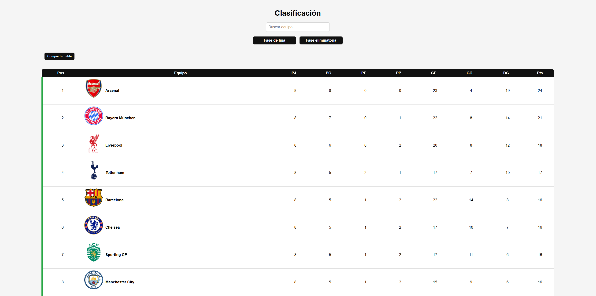
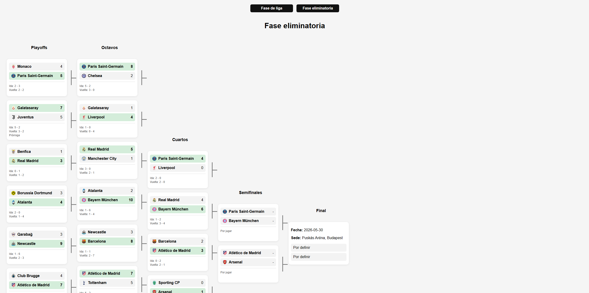
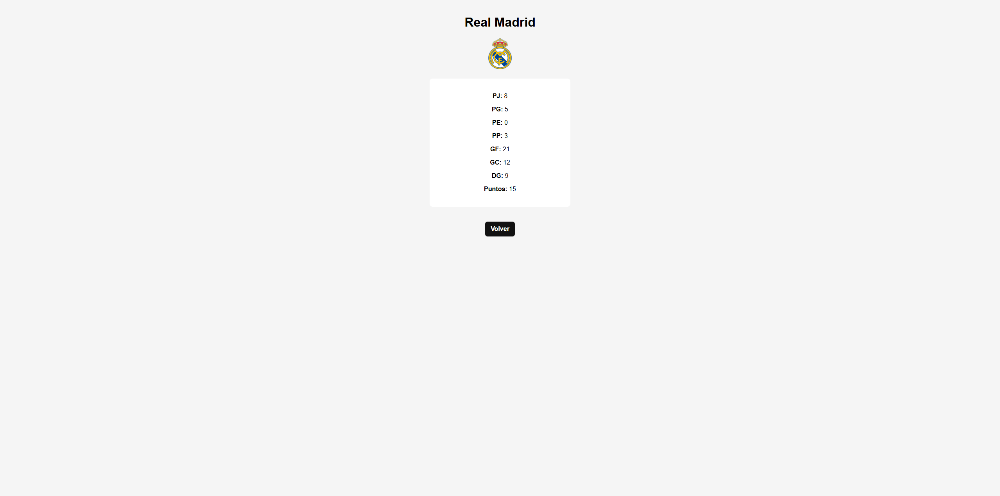

# ChampionsLeagues

A web application built with Flask that simulates a Champions League-style competition. 
This is my first web project built after completing CS50x.

## What I learned

- Building a full web app with Flask
- Working with JSON data
- Connecting backend (Python) with frontend (HTML/CSS/JS)
- Basic DOM manipulation and interactivity
- Structuring a small project

## Features

- Team standings table
- Real-time search
- Sortable columns
- Compact mode for the table
- Individual team pages
- Knockout stage with results and winners
- Automatic generation of semifinals and final
- Navigation between league, knockout stage and team pages

## Technologies

- Python
- Flask
- HTML
- CSS
- JavaScript
- JSON

## How to run

1. Clone the repository:

git clone https://github.com/ferggz/ChampionsLeagues.git

2. Go to the project folder:

cd ChampionsLeagues

3. Run the app:

python app.py

4. Open in your browser

## Screenshots

### League table

### Knockout stage

### Team page
